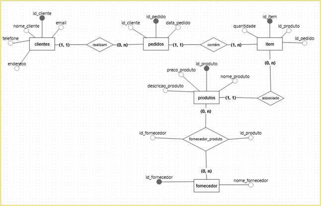

# dados_ecommerce
# Projeto de Modelagem de Dados e SQL para E-commerce

Este repositório contém os scripts SQL para a criação e consulta de um banco de dados de e-commerce, modelado a partir de um diagrama de Entidade-Relacionamento conceitual. O objetivo é demonstrar a modelagem de um sistema transacional básico e a execução de consultas MySQL para extrair informações relevantes.

## 📝 Escopo Geral

Este projeto simula um sistema de banco de dados para um site de comércio eletrônico, abrangendo entidades fundamentais como clientes, produtos, pedidos, itens de pedido e fornecedores. Ele foi concebido para ilustrar a aplicação de princípios de modelagem relacional e a manipulação de dados usando SQL, focando em operações comuns que um e-commerce realizaria.

## ✨ Funcionalidades e Recursos

Projetos de modelagem de dados e SQL, como este, geralmente incorporam as seguintes funcionalidades e recursos:

* **Modelagem Conceitual:**
    * Representação de entidades do mundo real.
    * Definição de cardinalidades:
        •	Clientes (1,1) ─────── (0,N) Pedidos  
          Um cliente pode ter zero ou mais pedidos, e cada pedido está associado a exatamente um cliente.
        
        •	Pedidos (1,1) ─────── (1,N) Itens  
          Um pedido contém um ou mais itens, e cada item pertence a exatamente um pedido.
        
        •	Produtos (1,1) → (0,N) Itens
          Cada produto pode estar associado a vários itens, mas cada item está associado a exatamente um produto.
        
        •	Produtos (0,N) ─────── (0,N) Fornecedores  
          Um produto pode ser fornecido por zero ou mais fornecedores, cada pode fornecer zero ou mais produtos.

    * Este projeto utiliza um diagrama de Entidade-Relacionamento (ERD) para visualizar a estrutura do banco de dados antes da implementação física, como visto na imagem fornecida.
    

* **Modelagem Lógica e Física:**
    * **Lógica:** Tradução do modelo conceitual para uma estrutura que pode ser implementada em um SGBD, definindo tabelas, colunas, tipos de dados e chaves primárias/estrangeiras.
    * **Física:** Implementação prática da modelagem lógica através de scripts DDL (Data Definition Language) para criar o esquema do banco de dados no MySQL.
 
* **Integridade dos Dados:**
    * Uso de chaves primárias (`PRIMARY KEY`) para garantir a unicidade e identificação de registros.
    * Uso de chaves estrangeiras (`FOREIGN KEY`) para impor a integridade referencial entre as tabelas, garantindo que os relacionamentos sejam válidos (ex: um `id_cliente` em `PEDIDOS` deve existir na tabela `CLIENTES`).
    * Restrições (`NOT NULL`, `UNIQUE`, `CHECK`) para garantir a validade e consistência dos dados (ex: `quantidade` de itens maior que zero).

* **Manipulação de Dados (DML - Data Manipulation Language):**
    * **Inserção (`INSERT`):** Adicionar novos registros nas tabelas (ex: novos clientes, produtos, pedidos).
    * **Seleção (`SELECT`):** Consultar e recuperar dados do banco de dados, com a capacidade de filtrar (`WHERE`), ordenar (`ORDER BY`), agrupar (`GROUP BY`) e sumarizar (`COUNT`, `SUM`) informações.
    * **Junções (`JOIN`):** Combinar dados de múltiplas tabelas com base em colunas relacionadas (`INNER JOIN`, `LEFT JOIN`), permitindo consultas complexas que envolvem diferentes entidades do sistema.

* **Otimização de Consultas:**
    * Embora não explicitamente abordado nos scripts, em projetos reais, a otimização de consultas (uso de índices, reescrita de queries) é fundamental para garantir o desempenho em grandes volumes de dados.

## 📂 Conteúdo do Repositório

* `criar_db.sql`: Contém os comandos SQL para criar o banco de dados `ecommerce`, definir as tabelas e popular as tabelas com dados de exemplo. Este arquivo deve ser executado primeiro.
* `queries.sql`: Contém uma série de consultas SQL para extrair diversas informações do banco de dados, demonstrando as capacidades de consulta do MySQL.

## 🚀 Como Usar

1.  **Clone o Repositório:**
    ```bash
    git clone [https://github.com/seu-usuario/seu-repositorio.git](https://github.com/seu-usuario/seu-repositorio.git)
    cd seu-repositorio
    ```
2.  **Acesse um Servidor MySQL:**
    Certifique-se de ter acesso a um servidor MySQL (local ou remoto).
3.  **Crie e Popule o Banco de Dados:**
    Execute o script `criar_db.sql` no seu servidor MySQL. Você pode fazer isso via linha de comando:
    ```bash
    mysql -u seu_usuario -p < criar_db.sql
    ```
    (Será solicitada sua senha do MySQL).
4.  **Execute as Consultas:**
    Após a criação do banco de dados e inserção dos dados, você pode executar as consultas do arquivo `queries.sql` em qualquer cliente MySQL (ex: MySQL Workbench, DBeaver, ou via linha de comando interativa).
    ```bash
    mysql -u seu_usuario -p ecommerce < queries.sql
    ```

## 👥 Contribuição

Contribuições são bem-vindas! Sinta-se à vontade para abrir issues ou pull requests.

## 📄 Licença

Este projeto está licenciado sob a Licença MIT.
